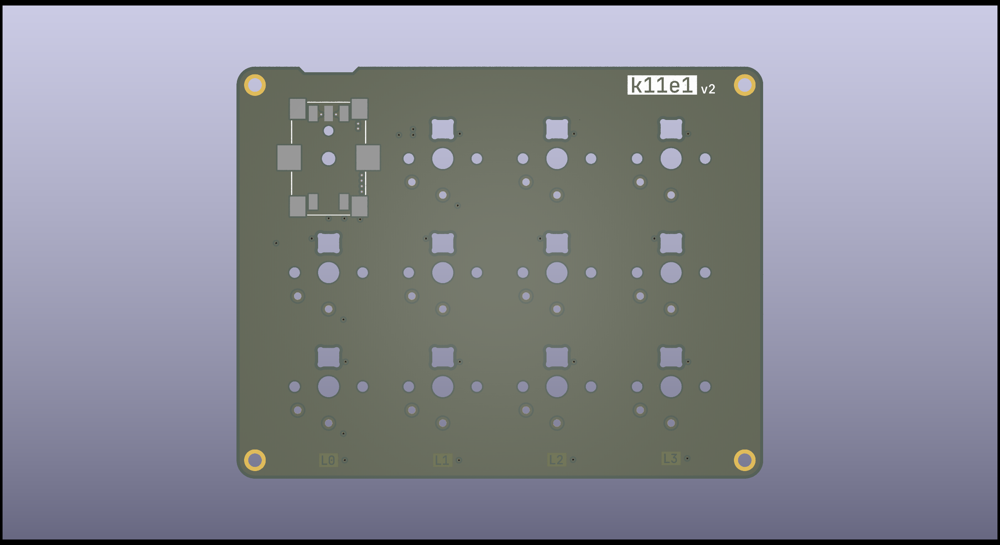
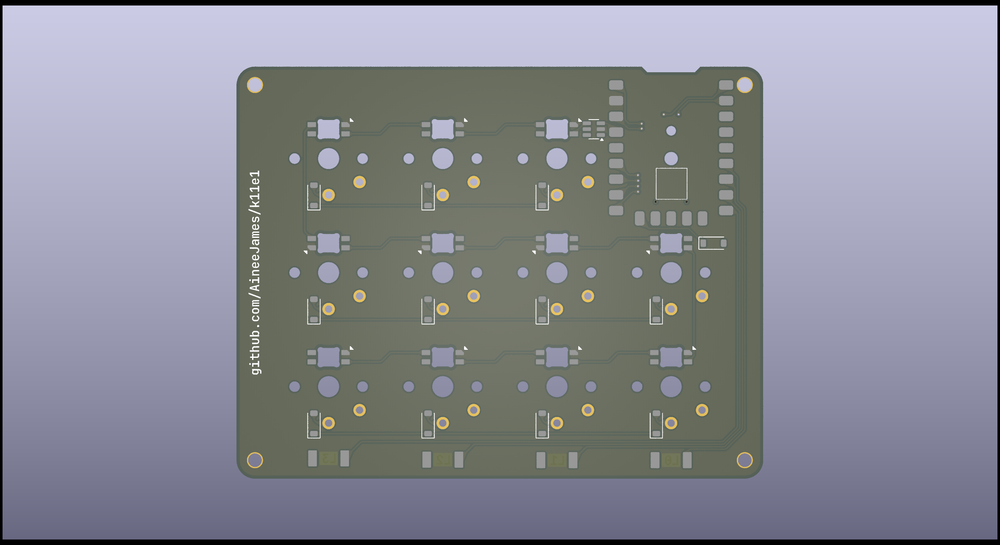

# k11e1 (11 keys, 1 encoder)
A simple and custom 4x3 macro pad.

### 🌟 Key Features:
- **VIA Support** ✅: Easily customizable through VIA, making it simple to remap keys without needing to recompile firmware.
- **RGB Lighting** 🌈: Adds a visually appealing touch and can be configured to indicate different modes or layers.
- **QMK Bootmagic** 🪄: Provides handy QMK functionalities, such as layer switching and reset options.
- **Active Layer Indicators** 💡: Great for visualizing which layer is currently active, especially useful in a compact macro pad setup.

### 🔧 Hardware:
- **Switches**: Kailh Choc (Low Profile) 🕹️ give a slim and sleek look while maintaining responsiveness.
- **MCU**: Waveshare RP2040-Zero ⚙️ is a solid choice, offering a lot of power and flexibility for your macros.
- **Keycaps**: Chocfox PBT in frosted transparent black 🌫️ adds a stylish, durable finish with a bit of flair thanks to the frosted transparency.

## PCB Images

