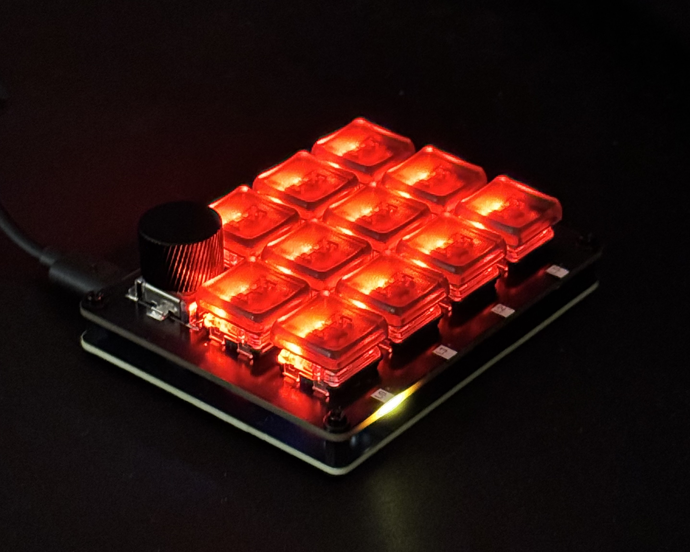
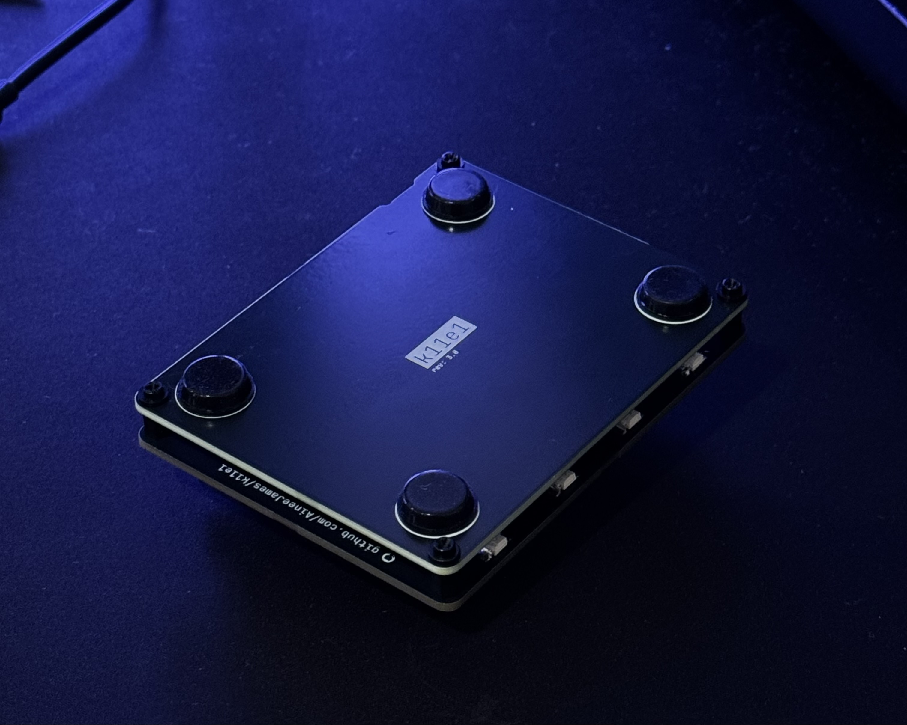
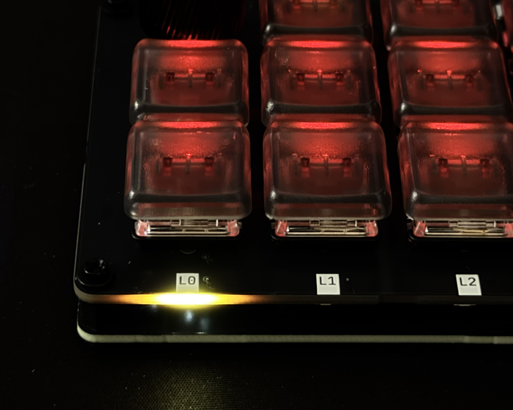

# k11e1 (11 keys, 1 encoder)

## 🌟 Key Features:
- **VIA Support**: Easily customizable through VIA, making it simple to remap keys without needing to recompile firmware.
- **RGB Lighting**: Adds a visually appealing touch and can be configured to display different lighting effects.
- **QMK**: Provides handy QMK functionalities, such as layer switching and boot/reset options.
- **Active Layer Indicators**: Great for visualizing which layer is currently active, especially useful in a compact macro pad setup.

## 🔧 Hardware:
- **Switches**: Kailh Choc (Low Profile) gives a slim and sleek look while maintaining responsiveness.
- **MCU**: Waveshare RP2040-Zero is a solid choice, offering a lot of power and flexibility for your macros.
- **Keycaps**: Chocfox PBT in frosted transparent black to let lighting shine through.

## ⚙️  Setup:
1. Assemble PCB
2. Plug in USB while holding the boot button
3. Drag `./firmware/k11e1_via.uf2` onto the boot drive.
4. Go to `usevia.app` and enable the design tab in `settings` > `Show Design tab`
5. Naviagate to the `DESIGN` tab and upload `./src/qmk_k11e1/via.json`
6. Click the `CONFIGURE` tab and then authorze the device (you should see the k11e1 show up here)
7. Done! Time to configure.
